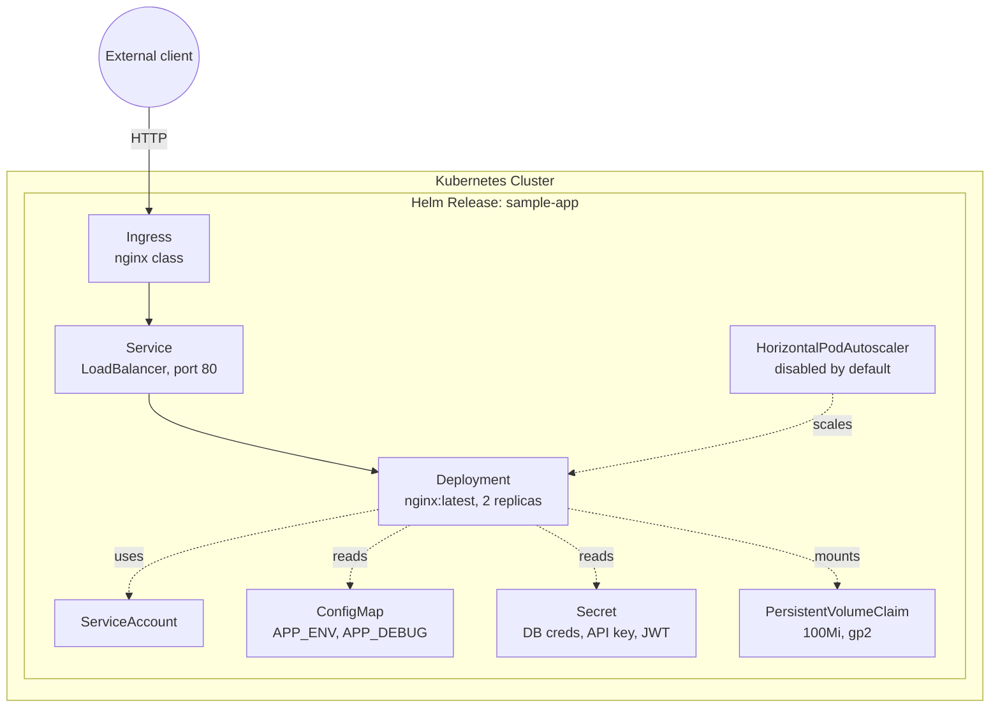

# Helm NGINX Kubernetes App Deployment

A small Helm chart that deploys NGINX to Kubernetes with the resources you'd actually want around a real deployment: a ConfigMap, a Secret, a PVC, an Ingress, an optional HPA, and a dedicated ServiceAccount. It's built as a learning/reference chart for how these pieces fit together with Helm templating, not as a full application.

There is no CI pipeline in this repo. There's no `.github/workflows` directory, so linting and deployment are manual: run `helm lint`, `helm template`, and `helm install` yourself, or wire them into your own pipeline.

## Architecture



Everything is driven from `sample-app/values.yaml`. The Deployment, Service, Ingress, ServiceAccount, and labels all go through `_helpers.tpl` so a release name change propagates consistently instead of resources getting hardcoded names.

One deliberate tradeoff: the Service is `type: LoadBalancer` and the PVC uses `storageClassName: gp2`, both of which assume you're running on AWS/EKS. That's fine for the reference use case this chart was built for, but it means the chart isn't cloud-portable as-is — on GKE, AKS, or a local cluster you'd need to override the storage class and probably switch the Service type or rely on the Ingress instead. The autoscaler is off by default (`autoscaling.enabled: false`) because without a metrics-server and real load, an HPA is just noise; it's there so it's one flag away when you actually need it.

## Project structure

```
.
├── sample-app/                       # Helm chart
│   ├── Chart.yaml
│   ├── values.yaml                   # Default values (contains placeholder secrets, don't ship as-is)
│   ├── values.yaml.example           # Same shape, meant to be copied and filled in
│   ├── .helmignore
│   └── templates/
│       ├── deployment.yaml
│       ├── service.yaml
│       ├── ingress.yaml
│       ├── configmap.yaml
│       ├── secret.yaml
│       ├── pvc.yaml
│       ├── hpa.yaml
│       ├── serviceaccount.yaml
│       ├── _helpers.tpl
│       ├── NOTES.txt                 # Printed after `helm install`
│       └── tests/
│           └── test-connection.yaml  # `helm test` — wget against the Service
├── validate.sh                       # Local pre-flight checks (kubectl/helm presence, lint, basic secret scan)
├── SECURITY.md
└── README.md
```

Earlier commits had a second, non-templated set of manifests (`nginx-deployment.yaml`, `nginx-content-configmap.yaml`, `sample-app-deployment.yaml`, `sample-app-service.yaml`) sitting alongside the real chart templates, left over from an earlier tutorial pass. Because Helm renders every file under `templates/`, those would have installed a second, hardcoded-namespace copy of the Deployment/Service/ConfigMap on top of the templated ones on every `helm install`. I removed them — they weren't referenced by anything and only existed to duplicate what `deployment.yaml`/`service.yaml`/`configmap.yaml` already do properly.

## How to run this

Requires `kubectl` and Helm 3 pointed at a working cluster (EKS/GKE/AKS/local — see the storage class caveat above).

```bash
git clone https://github.com/soodrajesh/Helm-NGINX-Kubernetes-APP-Deployment.git
cd Helm-NGINX-Kubernetes-APP-Deployment

# Start from the example values, don't use values.yaml's placeholders as-is
cp sample-app/values.yaml.example sample-app/values.yaml
# edit sample-app/values.yaml: set real secret values (base64-encoded), image tag, replica count, etc.

helm lint sample-app
helm install sample-app sample-app --create-namespace --namespace sample-app

kubectl get all -n sample-app
helm test sample-app -n sample-app
```

To upgrade or remove:

```bash
helm upgrade sample-app sample-app -n sample-app
helm uninstall sample-app -n sample-app
```

`validate.sh` runs a handful of sanity checks (kubectl/helm installed, chart lints, no obvious hardcoded secrets) before you deploy — it's a convenience script, not a CI job.

## Known gaps

- Secrets in `values.yaml` are plain base64 in a values file, which is only obfuscation, not encryption. There's no integration with Vault, SOPS, or Sealed Secrets — for anything beyond a demo you'd want one of those.
- No `securityContext`, `livenessProbe`, or `readinessProbe` on the Deployment. NGINX is forgiving enough that it mostly works without them, but a real deployment should have both probes and a non-root security context.
- The HPA template still targets `autoscaling/v2beta1`, which was removed in Kubernetes 1.26. It's disabled by default so it won't break anything until someone flips `autoscaling.enabled: true` on a modern cluster — at that point it needs porting to `autoscaling/v2`.
- No NetworkPolicy, despite `SECURITY.md` describing namespace isolation and least-privilege as goals. Namespace boundaries alone don't restrict pod-to-pod traffic.
- Chart is single-environment in practice: there's one `values.yaml`, not a values-per-environment layout, so promoting through dev/staging/prod means passing `--set` overrides or maintaining your own overlay files.
