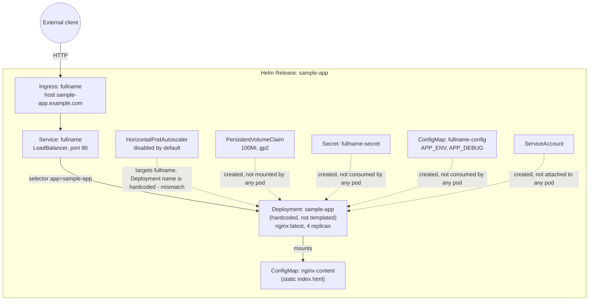

# Helm NGINX Kubernetes App Deployment

A small Helm chart that deploys NGINX to Kubernetes with the resources you'd
expect around a real deployment — a ConfigMap, a Secret, a PVC, an Ingress,
an optional HPA, and a ServiceAccount. It's a reference/learning chart for how
these pieces fit together with Helm templating, not a real application: the
"app" is stock `nginx:latest` serving a static page.

There is no CI pipeline in this repo. There's no `.github/workflows`
directory, so linting and deployment are manual: run `helm lint`,
`helm template`, and `helm install` yourself.

## Architecture



The chart mixes two authoring styles. `service.yaml`, `ingress.yaml`,
`hpa.yaml`, `pvc.yaml`, `secret.yaml`, `configmap.yaml`, and
`serviceaccount.yaml` are properly templated: they go through `_helpers.tpl`
for naming (`sample-app.fullname`, `sample-app.labels`) and read
`values.yaml`. `deployment.yaml` is not — it's a plain, hardcoded manifest
(literal name `sample-app`, namespace `default`, `image: nginx:latest`,
`replicas: 4`) left over from an earlier, pre-Helm version of this exercise.
It doesn't read `values.yaml` at all, so changing `replicaCount`,
`image.repository`/`image.tag`, or `resources` in `values.yaml` has no effect
on what actually gets deployed. The only thing it connects to is the
`nginx-content` ConfigMap it mounts by literal name for the static
`index.html`. The Secret, the second ConfigMap (`fullname-config`), the PVC,
and the ServiceAccount are all templated correctly but nothing in the
Deployment references them, so `helm install` creates them without them doing
anything.

One deliberate tradeoff that is real: the Service is `type: LoadBalancer` and
the PVC uses `storageClassName: gp2`, both of which assume AWS/EKS. On GKE,
AKS, or a local cluster you'd need to override the storage class and probably
switch the Service type or rely on the Ingress instead. The autoscaler is off
by default (`autoscaling.enabled: false`) because without a metrics-server and
real load an HPA does nothing useful; it's there to flip on later.

## Project structure

```
.
├── sample-app/                          # Helm chart
│   ├── Chart.yaml
│   ├── values.yaml                      # default values (contains placeholder secrets, see below)
│   ├── values.yaml.example              # same shape, meant to be copied and filled in
│   ├── .helmignore
│   └── templates/
│       ├── deployment.yaml              # hardcoded NGINX Deployment (not templated)
│       ├── nginx-content-configmap.yaml # static index.html mounted by deployment.yaml
│       ├── service.yaml
│       ├── ingress.yaml
│       ├── configmap.yaml               # separate, templated ConfigMap (APP_ENV/APP_DEBUG), unused by the Deployment
│       ├── secret.yaml                  # templated Secret, unused by the Deployment
│       ├── pvc.yaml                     # templated PVC, unused by the Deployment
│       ├── hpa.yaml
│       ├── serviceaccount.yaml          # templated ServiceAccount, unused by the Deployment
│       ├── _helpers.tpl
│       ├── NOTES.txt                    # printed after `helm install`
│       └── tests/
│           └── test-connection.yaml     # `helm test` - wget against the Service
├── validate.sh                          # local pre-flight checks (kubectl/helm presence, lint, basic secret scan)
├── SECURITY.md
└── README.md
```

Earlier commits also had `nginx-deployment.yaml`, `sample-app-deployment.yaml`,
and `sample-app-service.yaml` — a second, differently-namespaced copy of the
same Deployment/Service, and a version of the Deployment+ConfigMap duplicated
verbatim into one file with a conflicting replica count. Because Helm renders
every file under `templates/`, all of that installed on top of the real chart
on every `helm install`. Those three were genuine unreferenced duplicates and
have been removed. `nginx-content-configmap.yaml`, however, is not a
duplicate — `deployment.yaml` mounts it by name, so it stays.

## How to run this

Requires `kubectl` and Helm 3 pointed at a working cluster (EKS/GKE/AKS/local
— see the storage class caveat above).

```bash
git clone https://github.com/soodrajesh/Helm-NGINX-Kubernetes-APP-Deployment.git
cd Helm-NGINX-Kubernetes-APP-Deployment

# Start from the example values; values.yaml's placeholders aren't usable as-is
cp sample-app/values.yaml.example sample-app/values.yaml
# edit sample-app/values.yaml: set a real Ingress host, real base64-encoded
# secrets, etc. Note these won't change the image/replica count/resources
# that actually get deployed - see "Known gaps".

helm lint sample-app
helm install sample-app sample-app --create-namespace --namespace sample-app

kubectl get all -n sample-app
kubectl get all -n default   # deployment.yaml and nginx-content-configmap.yaml hardcode this namespace
helm test sample-app -n sample-app
```

To upgrade or remove:

```bash
helm upgrade sample-app sample-app -n sample-app
helm uninstall sample-app -n sample-app
```

`validate.sh` runs a handful of sanity checks (kubectl/helm installed, chart
lints, no obvious hardcoded secrets) before you deploy — it's a convenience
script, not a CI job.

## Known gaps

- **`deployment.yaml` isn't templated.** `values.yaml`'s `image`,
  `replicaCount`, and `resources` fields don't reach the actual Deployment —
  see "Architecture" above.
- **The HPA target and the Deployment name don't match.** `hpa.yaml` scales a
  Deployment named via `{{ include "sample-app.fullname" . }}`, but the real
  Deployment is hardcoded to the literal name `sample-app`. With
  `autoscaling.enabled: false` by default this has no effect today, but
  turning it on would not scale the real Deployment.
- **The PVC, Secret, `fullname-config` ConfigMap, and ServiceAccount are
  created but unused.** No template mounts the PVC, and nothing consumes the
  Secret or that ConfigMap as an environment variable, nor sets
  `serviceAccountName` on the pod spec.
- **`values.yaml` is committed, not gitignored.** `.gitignore` has patterns
  for `values-*.yaml` and `*-values.yaml`, but the actual filename here,
  `values.yaml`, matches neither, so it's tracked in git despite `SECURITY.md`
  saying it shouldn't be. The values in it are non-functional placeholders,
  not real secrets, but the pattern itself needs fixing before this chart
  were used with real values.
- Secrets in `values.yaml` are plain base64 in a values file, which is only
  obfuscation, not encryption. There's no integration with Vault, SOPS, or
  Sealed Secrets.
- No `securityContext`, `livenessProbe`, or `readinessProbe` on the
  Deployment.
- The HPA template targets `autoscaling/v2beta1`, which was removed in
  Kubernetes 1.26. It's disabled by default so this only matters if someone
  enables it on a modern cluster.
- No TLS. `values.yaml`'s `ingress` block has no `tls` entry and there's no
  cert-manager integration in the chart.
- No NetworkPolicy, despite `SECURITY.md` describing namespace isolation and
  least-privilege as goals. Namespace boundaries alone don't restrict
  pod-to-pod traffic.
- Single environment: one `values.yaml`, no per-environment values files, so
  promoting through dev/staging/prod means passing `--set` overrides or
  maintaining your own overlay files.

I also fixed one bug while reading through this: `service.yaml` selected
Pods using the `app.kubernetes.io/name` labels produced by the
`sample-app.selectorLabels` helper, but the actual (hardcoded) Deployment's
Pods are labelled plainly `app: sample-app` — the two never matched, so the
Service had no endpoints. Selector is now `app: sample-app`, and
`targetPort` is the literal `80` instead of a named port `http` that no
container defines.
